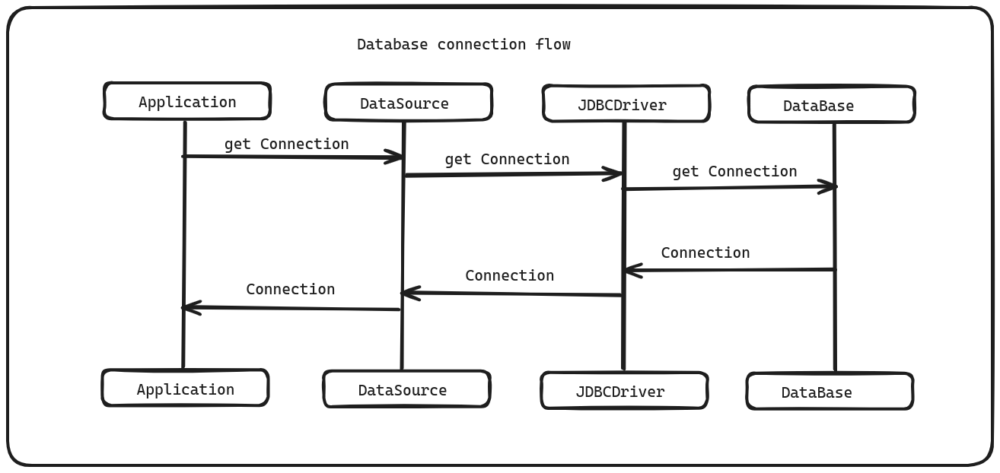
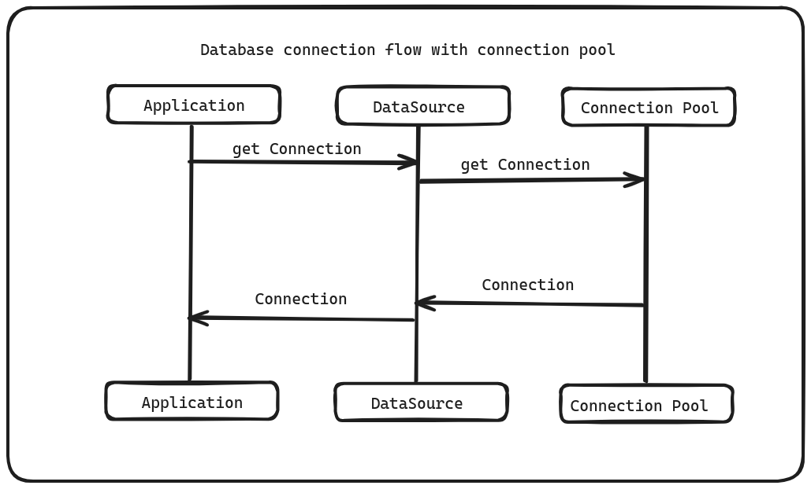

# Performance Tips

## Why Application is slow
- Poor database connection
- Too many queries
- Slow queries
- Wrong jpa mapping
- Fetching more than needed

## Flow of getting database connection

### Open socket
### TCP Handshake
### TSL negotiation
### Authentication

### On database side
- Each connection create new OS process
- Consumes some amount of RAM
- CPU context switching
##  Connection Pooling
- On application startup, creates a pool of physical connection.
- Reuse already opened connections.
- Create more connections when pool exhausted.
- network overhead is removed

## How big pool should be ?
### tomcat handles 200 request
### Hikari has 10 connection pool size.

###
#### @Transactional
#### N+1 issue
#### Projections
#### hikari.auto-commit: false
#### jpa.open-in-view: false

https://vladmihalcea.com/tutorials/flexypool/

https://github.com/gavlyukovskiy/spring-boot-data-source-decorator
https://github.com/maciejwalkowiak/performance-oriented-spring-data-jpa-talk/blob/main/pom.xml

https://github.com/jeanbisutti?tab=repositories
shiva/ci-cd/devops-zero-to-hero/docker-a-to-z/docker-compose-files/postgres/pg-dha

